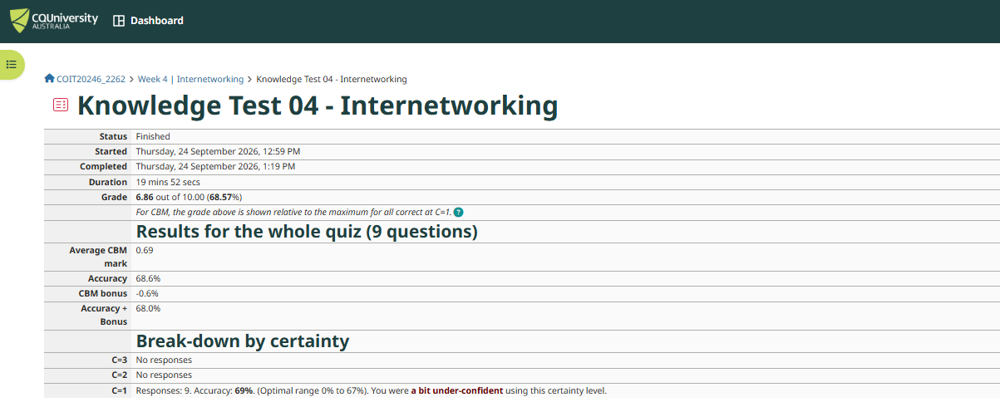
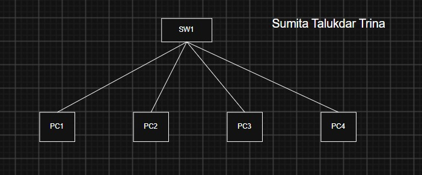
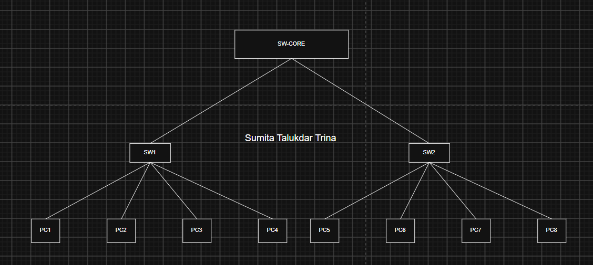
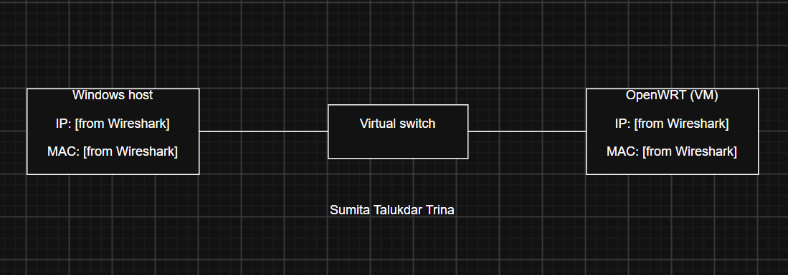
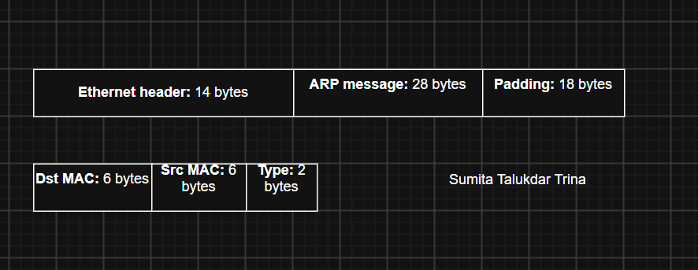
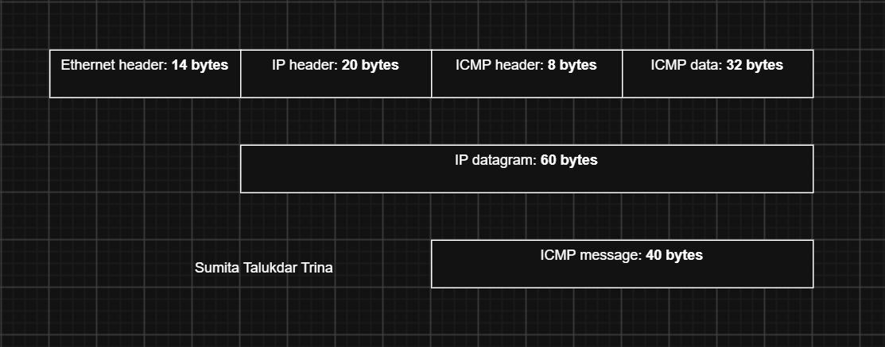

# Week 4 Journal – Network Technologies / Internetworking

**Student Name:** Sumita Talukdar Trina

---

## Task 1: Knowledge Test



I completed Knowledge Test 04 – Internetworking and scored **6.86 / 10 (68.6%)** on 9 questions.

I got the question on [topic] wrong. I thought [your answer], but the correct answer is [correct answer] because [reason].

I answered every question at certainty level 1 (C=1). The feedback said I was "a bit under-confident", because my accuracy (69%) was just above the optimal range for C=1. Next time I will choose a higher certainty on questions I am sure about, since certainty-based marking rewards confident correct answers.

---

## Task 2: Project Initiation

I am not in a project group. I am working on the project individually and will confirm this arrangement with my tutor.

---

## Task 3: Network Diagrams

### a) Switched LAN: one switch and four PCs



Original file: [week4-task3-lana.drawio](images/week4-task3-lana.drawio)

All four PCs connect to switch SW1 with their own dedicated link, so this is a star topology. The switch forwards frames only to the PC they are addressed to (using MAC addresses), rather than sending them to every device.

### b) Three switches and eight PCs in a star topology



Original file: [week4-task3-lanb.drawio](week4-task3-lanb.drawio)

PC1–PC4 connect to SW1 and PC5–PC8 connect to SW2. Both switches connect to SW-Core, forming a star of stars. If PC1 sends to PC5, the frame travels PC1 → SW1 → SW-Core → SW2 → PC5. The design is easy to extend by adding another switch to SW-Core, but SW-Core is a single point of failure: if it stops working, PCs on SW1 can no longer reach PCs on SW2.

---

## Task 4: Analyse Ping Packets

### Ping command and output

I cleared the ARP cache first (in PowerShell as Administrator) so that ARP would be needed again, then pinged the OpenWRT virtual machine:

```powershell
PS C:\WINDOWS\system32> arp -d *

PS C:\WINDOWS\system32> ping 192.168.1.2

Pinging 192.168.1.2 with 32 bytes of data:
Reply from 192.168.1.2: bytes=32 time=2063ms TTL=64
Reply from 192.168.1.2: bytes=32 time=38ms TTL=64
Reply from 192.168.1.2: bytes=32 time=67ms TTL=64
Reply from 192.168.1.2: bytes=32 time=310ms TTL=64

Ping statistics for 192.168.1.2:
    Packets: Sent = 4, Received = 4, Lost = 0 (0% loss),
Approximate round trip times in milli-seconds:
    Minimum = 38ms, Maximum = 2063ms, Average = 619ms
```

<!-- If you add a Wireshark screenshot later, put it here:

-->

### Network diagram



Original file: [week4-task4-ping.drawio](week4-task4-ping.drawio)

The Windows host and the OpenWRT VM (192.168.1.2) are on the same local network, connected through a virtual switch. Because they are on the same network, the ping is sent directly and no router is needed.

### Purpose of ARP packets

To send the ping, my Windows host already knew OpenWRT's **IP address** (192.168.1.2). However, on an Ethernet LAN a frame must be addressed to a **MAC address**, and after running `arp -d *` the host no longer had this mapping.

- **ARP request:** my Windows host sent a **broadcast** to `ff:ff:ff:ff:ff:ff`, received by every device on the LAN, asking "Who has 192.168.1.2? Tell [my Windows IP]".
- **ARP reply:** only OpenWRT answered, sending a **unicast** reply back to my host: "192.168.1.2 is at [OpenWRT MAC]".
- My host saved this in its ARP cache, so the next pings did not need ARP again.

This explains my ping output: the **first reply took 2063 ms**, but the later replies took only 38–310 ms. The first ping had to wait for ARP to resolve the MAC address first.

### ARP packet diagram (1st ARP packet)



Original file: [week4-task4-arp-packet.drawio](week4-task4-arp-packet.drawio)

The ARP message (28 bytes) is carried directly inside an Ethernet frame. The Ethernet header (14 bytes) holds the destination MAC (6 bytes, the broadcast address for a request), the source MAC (6 bytes) and the Type field (2 bytes, 0x0806 = ARP). The total is 42 bytes. ARP has no IP header because it works at the data link level, below IP.

### First two ICMP packets

1. **ICMP Echo Request (type 8):** sent from my Windows host to 192.168.1.2. It carries 32 bytes of data (`bytes=32` in the output), plus an identifier and sequence number.
2. **ICMP Echo Reply (type 0):** sent from 192.168.1.2 back to my host, with the **same identifier and sequence number**, so ping can match each reply to its request and calculate the round-trip time.

The reply had **TTL=64**. Linux systems usually start at TTL 64 while Windows uses 128, so this confirms the reply came from the Linux-based OpenWRT. Since 64 is the starting value, the packet crossed no routers, which matches my diagram where both devices are on the same LAN.

### ICMP packet diagram (1st ICMP packet)



Original file: [week4-task4-icmp-packet.drawio](week4-task4-icmp-packet.drawio)

The Echo Request shows encapsulation across layers:

| Layer | Header / part | Size |
|---|---|---|
| Data link | Ethernet header (Type 0x0800 = IPv4) | 14 bytes |
| Network | IP header (Protocol 1 = ICMP) | 20 bytes |
| Network (ICMP) | ICMP header | 8 bytes |
| Data | ICMP data | 32 bytes |
| | **Total frame** | **74 bytes** |

The ICMP message (8 + 32 = 40 bytes) is inside the IP datagram (20 + 40 = 60 bytes), which is inside the Ethernet frame (14 + 60 = 74 bytes).

---

## Reflection

This week connected the lecture on internetworking with a real test. The lecture explained that IP addresses and routing tables get packets **across** networks, while this task showed that on the **local** network a device still needs the MAC address, and ARP is what finds it. I did not realise before that a simple ping actually uses two protocols (ARP and ICMP). The slow first reply (2063 ms) was a clear example of ARP happening before the ping could be sent.

Drawing the packet diagrams helped me understand encapsulation: each layer adds its own header, so the 32 bytes of ping data became a 74-byte frame. I also learned that the TTL value gives a hint about the operating system of the device replying.

What I found tricky: [write one thing that was difficult for you, e.g. running `arp -d *` needed Administrator rights, or understanding why ARP has no IP header].
