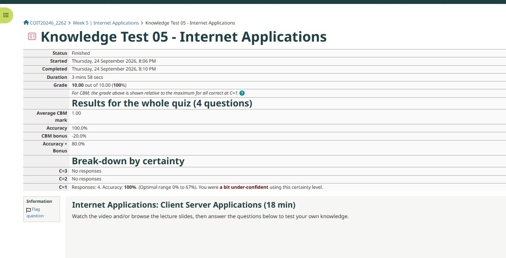
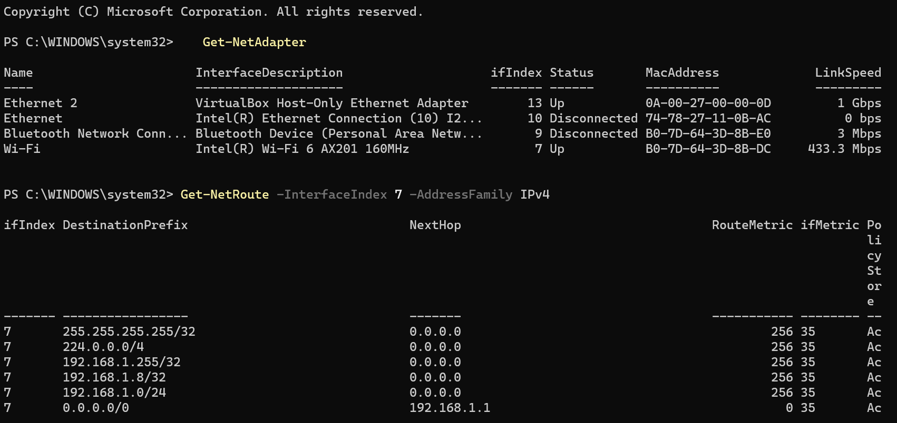
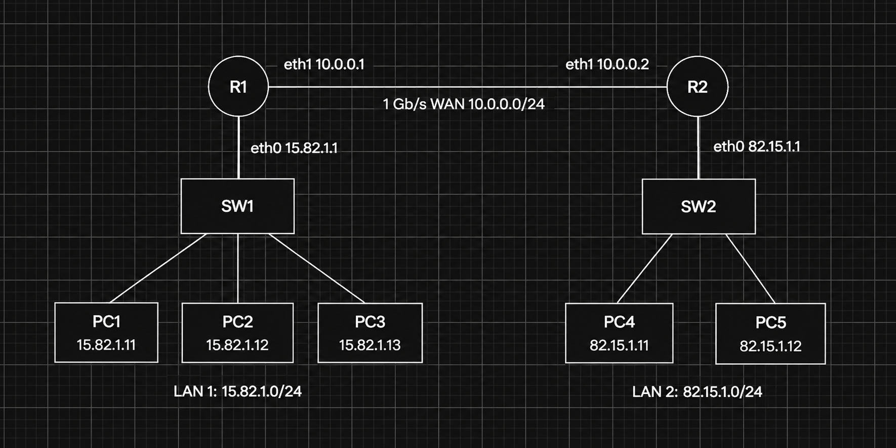
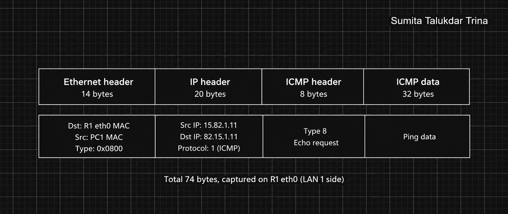
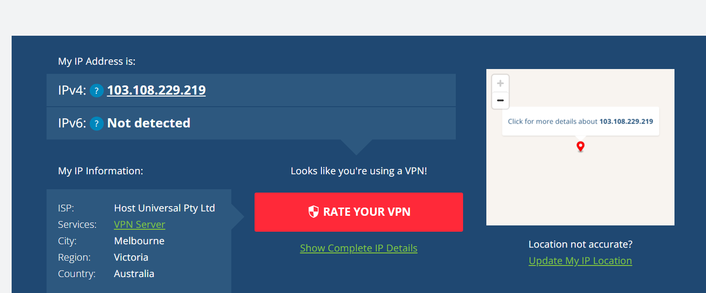
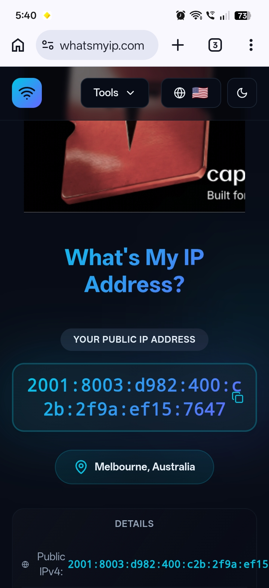

# Week 5 Journal

**Student Name:** Sumita Talukdar Trina

**Topics:** Internetworking (tutorial) and Internet Applications (lecture)

---

## Task 1 - Knowledge Test



I did the Week 5 Knowledge Test on Internet Applications (Client Server Applications) and got **10 out of 10 (100%)**. I got all 4 questions right and it took me just under 4 minutes.

The questions were about client server applications, like how the client sends a request and the server sends back a response. This week felt easier than Week 4 for me.

I used certainty level 1 for all 4 questions again. The feedback said I was "a bit under-confident", the same as in Week 4. Because all my answers were right, the low certainty gave me a CBM bonus of -20%, so my accuracy + bonus was only 80%. In Week 4 I said I would pick a higher certainty when I am sure, but I did not do it this time. Next week I will use C=2 or C=3 for the questions I am confident about.

---

## Task 2 - Routing Table

I used `Get-NetAdapter` to find my Wi-Fi adapter (ifIndex 7), then viewed its routing table:

```powershell
PS C:\WINDOWS\system32> Get-NetRoute -InterfaceIndex 7 -AddressFamily IPv4

ifIndex DestinationPrefix    NextHop       RouteMetric ifMetric PolicyStore
------- ------------------   -------       ----------- -------- -----------
7       255.255.255.255/32   0.0.0.0       256         35       Active
7       224.0.0.0/4          0.0.0.0       256         35       Active
7       192.168.1.255/32     0.0.0.0       256         35       Active
7       192.168.1.8/32       0.0.0.0       256         35       Active
7       192.168.1.0/24       0.0.0.0       256         35       Active
7       0.0.0.0/0            192.168.1.1   0           35       Active
```



In this table, NextHop 0.0.0.0 means "send direct" (no router needed), and 0.0.0.0/0 means "any other destination" (the * from the lecture).

| Destination | Next Hop | What it means |
|---|---|---|
| 255.255.255.255/32 | 0.0.0.0 | Local broadcast. To send to everyone on my network, send direct. |
| 224.0.0.0/4 | 0.0.0.0 | Multicast addresses (starting 224 to 239). Send direct. |
| 192.168.1.255/32 | 0.0.0.0 | Directed broadcast for my network 192.168.1.0/24. Send direct to everyone on it. |
| 192.168.1.8/32 | 0.0.0.0 | This is my own laptop's IP address. Send direct. |
| 192.168.1.0/24 | 0.0.0.0 | Any device on my home network (192.168.1.1 to .254). Send direct, no router needed. |
| 0.0.0.0/0 | 192.168.1.1 | Default route. Anything else, like websites on the Internet, goes to my home router 192.168.1.1. |

My table looks almost the same as the example in the lecture, just with different addresses. Most rows are "direct" because they are on my own network. Only the last row uses a router, and that one row covers the whole Internet. This shows why default routes are useful: my laptop does not need to know a path to every network, it just sends everything unknown to the router.

I also used `Find-NetRoute -RemoteIPAddress 192.168.1.2` to check which route my Week 4 ping used. It matched the 192.168.1.0/24 row on my Wi-Fi, which showed me that 192.168.1.2 was a device on my home network and not my OpenWRT VM.

---

## Task 3 - IP Network Design

I did this task on my own because I am not in a project group. The task says to use the last four digits of my student ID for one LAN and my partner's for the other. My last four digits are **1582**, so LAN 1 is **15.82.1.0/24**. Since I have no partner, I used my digits reversed for LAN 2: **82.15.1.0/24**. For the WAN link I chose **10.0.0.0/24**.

### a) IP addresses

Each router has 2 ports, so I used eth0 for its LAN and eth1 for the WAN link. The switches do not need IP addresses because they only forward Ethernet frames and do not use IP.

| Device | Interface | IP address | Network |
|---|---|---|---|
| PC1 | eth0 | 15.82.1.11/24 | LAN 1 |
| PC2 | eth0 | 15.82.1.12/24 | LAN 1 |
| PC3 | eth0 | 15.82.1.13/24 | LAN 1 |
| R1 | eth0 | 15.82.1.1/24 | LAN 1 |
| R1 | eth1 | 10.0.0.1/24 | WAN |
| R2 | eth1 | 10.0.0.2/24 | WAN |
| R2 | eth0 | 82.15.1.1/24 | LAN 2 |
| PC4 | eth0 | 82.15.1.11/24 | LAN 2 |
| PC5 | eth0 | 82.15.1.12/24 | LAN 2 |
| SW1, SW2 | - | no IP | - |

I gave each router the .1 address on its LAN so it is easy to remember as the gateway.

### b) Network diagram



Draw.io file: [week5-task3-network.drawio](images/week5-task3-network.drawio)

### c) Routing tables

**PC1, PC2 and PC3** (all the same):

| Destination | Next |
|---|---|
| 15.82.1.0/24 | direct |
| * | 15.82.1.1 |

**PC4 and PC5** (both the same):

| Destination | Next |
|---|---|
| 82.15.1.0/24 | direct |
| * | 82.15.1.1 |

**Router R1:**

| Destination | Next |
|---|---|
| 15.82.1.0/24 | direct |
| 10.0.0.0/24 | direct |
| 82.15.1.0/24 | 10.0.0.2 |

**Router R2:**

| Destination | Next |
|---|---|
| 82.15.1.0/24 | direct |
| 10.0.0.0/24 | direct |
| 15.82.1.0/24 | 10.0.0.1 |

The PCs only need two rows: their own LAN is direct, and everything else goes to their router. The routers are directly attached to two networks each, so they only need one extra row to reach the LAN on the other side of the WAN link. I did not give the routers a default route (*) because this test network is not connected to the Internet.

### d) Packet diagram

Example: PC1 (15.82.1.11) pings PC4 (82.15.1.11), and I capture the packet on **R1's eth0** interface, as it arrives from LAN 1.



Draw.io file: [week5-task3-packet.drawio](images/week5-task3-packet.drawio)

**IP addresses in the packet:**
- Source IP = 15.82.1.11 (PC1)
- Destination IP = 82.15.1.11 (PC4)

**MAC addresses in the Ethernet frame:**
- Source MAC = PC1's MAC address
- Destination MAC = R1 eth0's MAC address

The interesting part is that the IP addresses and the MAC addresses point to different devices. The IP addresses show the start and the end of the whole journey (PC1 to PC4), and they stay the same the whole way. The MAC addresses only cover one hop. PC1 looks at its routing table, sees that 82.15.1.11 is not on its LAN, so it sends the frame to its router, using R1's MAC address.

If I captured the same ping on the WAN link instead, the IP addresses would be the same, but the MACs would change to source = R1 eth1 and destination = R2 eth1. On LAN 2 they would be R2 eth0 to PC4. So every router takes off the old Ethernet header and puts on a new one for the next hop.

---

## Task 4 - Academic Integrity

**Scenario I chose:** A student is running late with their journal, so they ask a friend for their Wireshark and PowerShell screenshots and put them in their own journal as if they did the tasks themselves.

**What would happen:** Under the CQUniversity Academic Integrity Policy and Procedure, this is a breach of academic integrity because the student is handing in someone else's work as their own. The marker would report it, and the student would be told about the concern and given a chance to explain. The outcome depends on how serious it is and if it is their first time. For a first, small breach it could be a warning and an academic integrity module to complete. For a more serious case it could be a reduced mark or 0 for the assessment, and repeated or serious breaches can be sent to a misconduct process. The friend who shared the screenshots can also be in trouble, because helping someone cheat is a breach too.

This unit also has its own rule for this. If screenshots or data are identical to another student's, that whole week gets 0. So in this scenario the student would lose the marks for that week anyway, even before the policy outcome.

**My two recommendations:**

1. **Always do the tasks yourself, even if you are late.** It is better to hand in a late task with your own screenshots than an on-time one with copied work. Your own output is different anyway, like my laptop IP 192.168.1.8 and my MAC address, so copied screenshots are easy to spot.
2. **If you use AI, use it to help, not to do the work.** The unit allows AI for drafting and refining, but you must check and edit what it gives you. I check every command output and diagram against what I actually did on my own laptop.

---

## Task 5 - IP Address Lookup





I checked whatismyipaddress.com on my home Wi-Fi and then on my phone's mobile hotspot.

| | Home Wi-Fi | Mobile hotspot |
|---|---|---|
| Public IP | 103.108.229.219 | [hotspot public IP] |
| ISP shown | Host Universal Pty Ltd | [mobile carrier] |
| Location shown | Melbourne, Victoria, Australia | [city, region] |
| My laptop's private IP | 192.168.1.8 | [new private IP from ipconfig] |

The website did not see my laptop's IP 192.168.1.8. That is a private IP address, which only works inside my home network. My home router uses NAT (Network Address Translation) to change my private IP to its public IP 103.108.229.219 before the packet goes out to the Internet. So every device in my house shares the same public IP, and the website only sees the router.

The website showed my location as Melbourne, Victoria. This is only at the city level. It did not show my suburb or street.

On the hotspot, the public IP changed to a different address and the ISP changed to my mobile carrier. My laptop also got a new private IP from my phone. This shows that the public IP belongs to the network I am connected to, not to my laptop.

What I learned is that these websites do not use GPS. They just look up who owns the IP address in a database, so the location is only a rough guess. Even so, any website I visit can see my public IP, which company it belongs to, and roughly what city I am in, without me typing anything in. It cannot see my exact address or which device in my house I am using, because NAT hides that.

---

## Reflection

This week's lecture was about Internet Applications and the client server model. The client sends a request and the server sends back a response. Doing the tasks helped me see how this works underneath.

The IP lookup task was the one that connected best to the lecture. When I opened whatismyipaddress.com, my browser was the client and the website was the server. The server has to know my public IP, otherwise it cannot send the response back. That is why every website can see it. But it only sees my router's public IP, not my laptop, because of NAT.

The routing table task also made more sense after Week 4. My laptop only has one route that goes to a router, the default route to 192.168.1.1. So when I visit any website, the request goes to my home router first and then out to the Internet. My routing table looked very close to the lecture example, which was nice to see.

The network design task was the hardest part for me. At first I thought the MAC addresses in the packet would be PC1 and PC4, the same as the IP addresses. Drawing the packet diagram made me understand that the MAC addresses change at every router, but the IP addresses stay the same from start to end.

I also noticed I was under-confident again in the Knowledge Test. I got 100% but still lost marks because I picked the lowest certainty. Next week I want to trust my answers more when I have done the reading.
