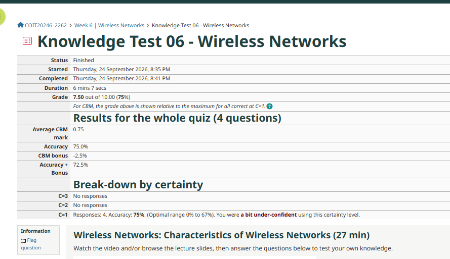
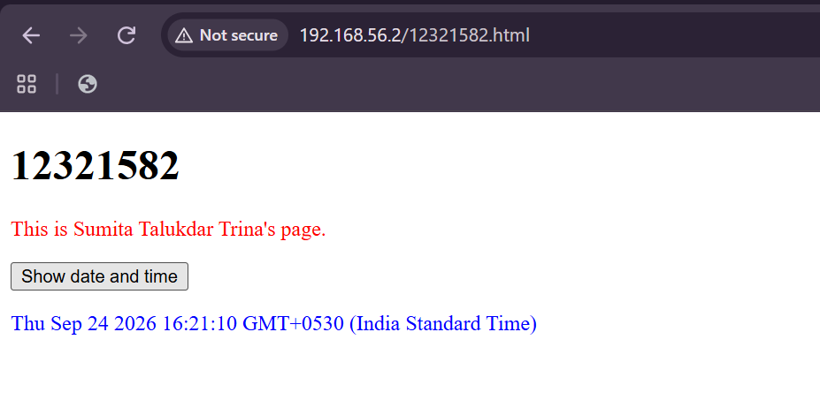
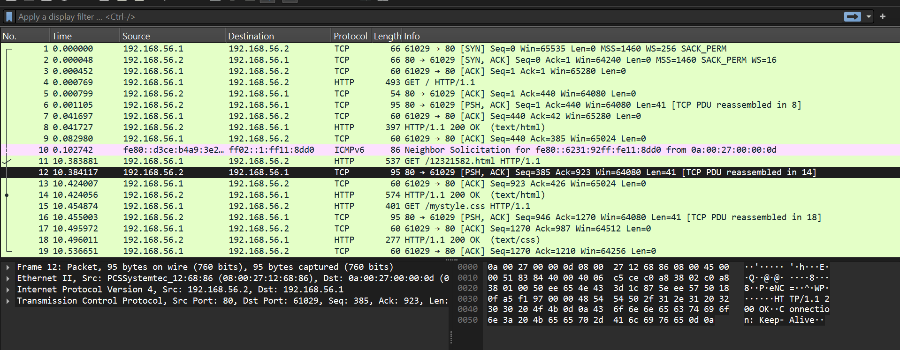
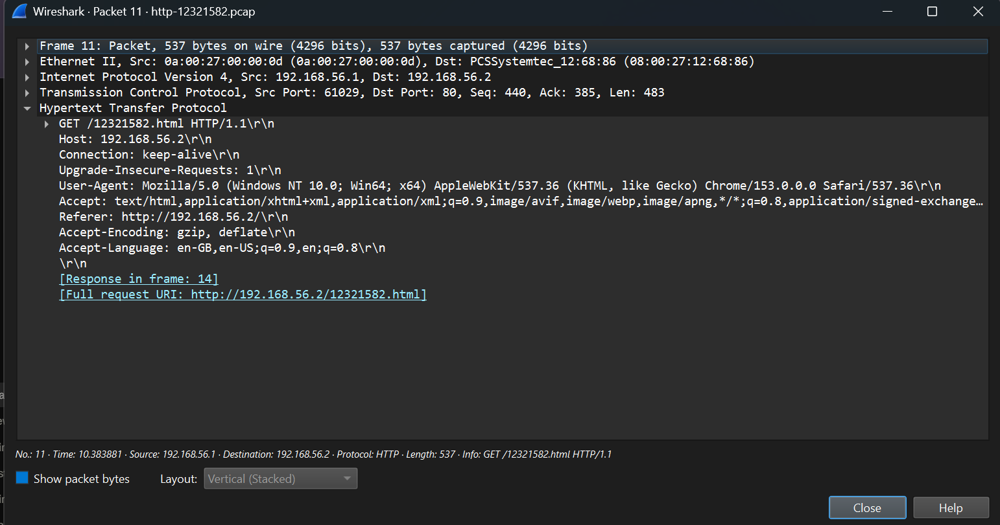
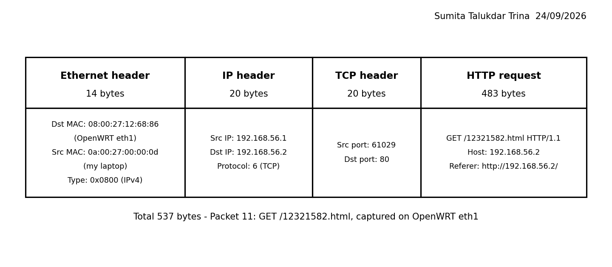
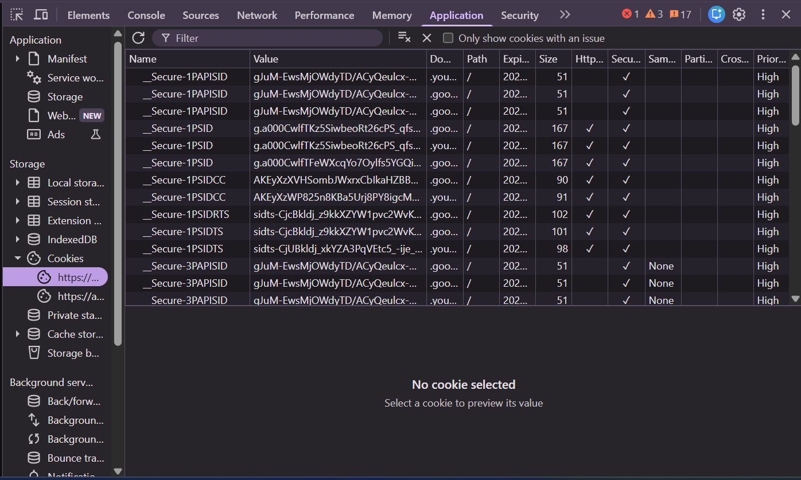

# Week 6 Journal

**Student Name:** Sumita Talukdar Trina

**Topics:** Internet Applications (tutorial) and Wireless Networks (lecture)

---

## Task 1 - Knowledge Test



I did the Week 6 Knowledge Test on Wireless Networks (Characteristics of Wireless Networks) and got **7.5 out of 10 (75%)**. I got 3 out of 4 questions right and 1 wrong. It took me about 6 minutes, which is longer than Week 5, because the wireless topic was new to me.

I used certainty level 1 for all 4 questions again, and the feedback said I was "a bit under-confident" for the third week in a row. My CBM bonus was -2.5%, so my accuracy + bonus was 72.5%. I keep saying I will use a higher certainty, but I have not done it yet. I think the reason is I am scared of losing marks if I am wrong. But my results show I am right most of the time, so next week I will really try C=2 for the questions I am sure about.

---

## Task 2 - Create Web Pages in OpenWRT

I logged in to my OpenWRT VM from PowerShell with `ssh root@192.168.56.2` and went to the web server folder `/srv/www`. I copied `index.html` to a new file named with my student ID, then wrote my own page and a new CSS file. I also added a link to my page in `index.html`.

```bash
cd /srv/www
cp index.html 12321582.html
ls
12321582.html  index.html  mystyle.css
```

Files: [index.html](images/index.html), [12321582.html](images/12321582.html), [mystyle.css](images/mystyle.css)

**12321582.html**

```html
<!DOCTYPE html>
<html>
<head>
<title>Sumita's page</title>
<link rel="stylesheet" href="mystyle.css">
</head>
<body>
<h1>12321582</h1>
<p class="intro">This is Sumita Talukdar Trina's page.</p>
<button type="button" onclick="document.getElementById('demo').innerHTML = Date()">Show date and time</button>
<p id="demo"></p>
</body>
</html>
```

**mystyle.css**

```css
.intro { color: red; }
#demo { color: blue; }
```

**The link I added in index.html**

```html
<p><a href="12321582.html">Sumita Talukdar Trina page</a></p>
```



The screenshot shows my page after I clicked "Show date and time". My name is in red because of the `.intro` rule in the CSS file, and the date is in blue because of the `#demo` rule. I like that the HTML only says what is on the page, and the CSS file decides how it looks. If I want to change the colour, I only need to change `mystyle.css`, not the page itself.

---

## Task 3 - Capture HTTP Packets

### Packet capture

When I first ran the tcpdump command on `eth0` it gave the error `tcpdump: eth0: That device is not up`. I used `ip addr` to check, and my VM's address 192.168.56.2 is actually on **eth1** (MAC 08:00:27:12:68:86), not eth0. So I changed the command:

```bash
root@OpenWrt:~# tcpdump -i eth1 -n -w http-12321582.pcap 'not tcp port 22'
tcpdump: listening on eth1, link-type EN10MB (Ethernet), capture size 262144 bytes
^C19 packets captured
19 packets received by filter
0 packets dropped by kernel
```

While it was running, I opened an incognito window, visited http://192.168.56.2/, clicked the link to my page, and clicked the button two times. Then I copied the file to my laptop with `scp`.

Capture file: [http-12321582.pcap](images/http-12321582.pcap)

### ARP table

I opened PowerShell as Administrator, cleared the ARP table, checked it, pinged my home router, and checked it again:

```powershell
PS C:\WINDOWS\system32> arp -d *
PS C:\WINDOWS\system32> Get-NetNeighbor -InterfaceIndex 7 -AddressFamily IPv4

ifIndex IPAddress       LinkLayerAddress      State       PolicyStore
------- ---------       ----------------      -----       -----------
7       224.0.0.22      01-00-5E-00-00-16     Permanent   ActiveStore
7       192.168.1.2     00-00-00-00-00-00     Unreachable ActiveStore
7       192.168.1.1     00-00-00-00-00-00     Unreachable ActiveStore

PS C:\WINDOWS\system32> ping 192.168.1.1
Reply from 192.168.1.1: bytes=32 time=2ms TTL=64
Reply from 192.168.1.1: bytes=32 time=2ms TTL=64
Reply from 192.168.1.1: bytes=32 time=3ms TTL=64
Reply from 192.168.1.1: bytes=32 time=3ms TTL=64

PS C:\WINDOWS\system32> Get-NetNeighbor -InterfaceIndex 7 -AddressFamily IPv4

ifIndex IPAddress       LinkLayerAddress      State       PolicyStore
------- ---------       ----------------      -----       -----------
7       224.0.0.22      01-00-5E-00-00-16     Permanent   ActiveStore
7       192.168.1.2     00-00-00-00-00-00     Unreachable ActiveStore
7       192.168.1.1     60-31-92-11-8D-D0     Reachable   ActiveStore
```


I used interface 7 because that is my Wi-Fi, which is my main network adapter.

After clearing the table, my router 192.168.1.1 showed as Unreachable with MAC 00-00-00-00-00-00, because my laptop had forgotten its MAC address. After the ping it changed to **Reachable** with the real MAC **60-31-92-11-8D-D0**. So the ping made my laptop use ARP again to find the router's MAC, just like in Week 4.

The only device that is **Reachable** is my home router 192.168.1.1. This makes sense because every packet I send to the Internet goes through it (it is my default route from Week 5). The device 192.168.1.2 that I pinged in Week 4 is now **Unreachable**, so it is not on my Wi-Fi at the moment. When I tried `ssh root@192.168.1.2` this week, it also timed out. This proves again that 192.168.1.2 was never my OpenWRT VM.

The 224.0.0.22 entry is Permanent. It is a multicast address, so Windows can work out its MAC (01-00-5E-...) from the IP address without asking with ARP.

---

## Task 4 - Analyse HTTP Packet Capture





My capture has 19 packets. My laptop on the VirtualBox network is 192.168.56.1 (MAC 0a:00:27:00:00:0d) and the OpenWRT web server is 192.168.56.2 (MAC 08:00:27:12:68:86).

### a) Each HTTP request and response

| Request | What triggered it | What was requested | Response |
|---|---|---|---|
| Packet 4 (0.000769 s) | I typed http://192.168.56.2/ in the incognito window | `GET /` (the home page index.html) | Packet 8: `HTTP/1.1 200 OK (text/html)` |
| Packet 11 (10.383881 s) | I clicked the link "Sumita Talukdar Trina page" | `GET /12321582.html` | Packet 14: `HTTP/1.1 200 OK (text/html)` |
| Packet 15 (10.454874 s) | Nobody clicked anything. The browser read my page, saw `<link rel="stylesheet" href="mystyle.css">`, and asked for the CSS file by itself | `GET /mystyle.css` | Packet 18: `HTTP/1.1 200 OK (text/css)` |

All three requests worked, so every response was 200 OK. The interesting one is the CSS file. I only clicked once, but the browser sent two requests, because one web page can need more than one file.

### b) Five address values for the first request (packet 4)

| Value | What it identifies |
|---|---|
| Source IP: 192.168.56.1 | My laptop (host) |
| Destination IP: 192.168.56.2 | The OpenWRT web server (host) |
| Transport protocol: TCP (IP protocol 6) | The transport protocol |
| Source port: 61029 | The web browser on my laptop (application) |
| Destination port: 80 | The web server application (HTTP) |

Port 80 is the normal port for HTTP. Port 61029 was picked randomly by my laptop for the browser.

### c) Did clicking the button send a request?

**No.** I clicked the button two times, but there is no request for it. The last HTTP packet is the CSS response in packet 18 at 10.496 s, and the capture ends at packet 19.

This is because the button runs JavaScript (`Date()`) inside my browser. The browser already had the whole page, so it did not need the server. The time on the page also comes from my laptop's clock, not from the server.

### d) Packet diagram for the request for my page (packet 11)



Draw.io file: [week6-task4-packet.drawio](images/week6-task4-packet.drawio)

| Part | Size | Addresses |
|---|---|---|
| Ethernet header | 14 bytes | Dst MAC 08:00:27:12:68:86 (OpenWRT eth1), Src MAC 0a:00:27:00:00:0d (my laptop), Type 0x0800 |
| IP header | 20 bytes | Src IP 192.168.56.1, Dst IP 192.168.56.2, Protocol 6 (TCP) |
| TCP header | 20 bytes | Src port 61029, Dst port 80 |
| HTTP request | 483 bytes | `GET /12321582.html`, Host: 192.168.56.2, Referer: http://192.168.56.2/ |
| **Total** | **537 bytes** | |

Wireshark shows TCP `Len: 483`, and 14 + 20 + 20 + 483 = 537, which matches the frame size. The HTTP request is almost 90% of the packet. That is much bigger than I expected for asking for one small page, because the browser adds a lot of extra header lines.

### e) Referer

The Referer is `http://192.168.56.2/`. It tells the server which page I was on when I clicked the link, which was the home page index.html.

Web servers can use this to:
- see where their visitors come from (for example Google, Facebook or another website)
- count which links people click the most
- track users across pages for advertising
- stop other websites from linking directly to their images or files

### f) What the server learned about my browser

From the User-Agent line:

```
User-Agent: Mozilla/5.0 (Windows NT 10.0; Win64; x64) AppleWebKit/537.36 (KHTML, like Gecko) Chrome/153.0.0.0 Safari/537.36
```

- **Browser:** Google Chrome, version 153
- **Operating system:** Windows (NT 10.0, which is Windows 10 or 11), 64-bit

The words "Mozilla" and "Safari" are only there for old compatibility reasons. It is really Chrome.

The server also learned my language from `Accept-Language: en-GB,en-US` (English), and that my browser can take compressed files from `Accept-Encoding: gzip, deflate`. I did not choose to send any of this, the browser sends it automatically with every request.

### g) HTTP version and transport protocol

The version is **HTTP/1.1** (you can see `GET / HTTP/1.1` and `HTTP/1.1 200 OK`). The transport protocol is **TCP**, on port 80.

I also noticed that all three requests used the **same TCP connection** (my port 61029 every time), because the request had `Connection: keep-alive`. So the browser did the handshake only once and then reused it for all the files.

### h) Connection setup

| Packet | Time | From → To | Flags |
|---|---|---|---|
| 1 | 0.000000 | 192.168.56.1 → 192.168.56.2 | SYN |
| 2 | 0.000048 | 192.168.56.2 → 192.168.56.1 | SYN, ACK |
| 3 | 0.000452 | 192.168.56.1 → 192.168.56.2 | ACK |

This is the TCP three-way handshake. My laptop asks to connect (SYN), the server agrees (SYN, ACK), and my laptop confirms (ACK). The data transfer started with packet 4 (`GET /`) at 0.000769 s. So it took **0.769 ms** from the start of connection setup to the start of data transfer. It is very fast because the VM is on my own laptop.

### i) Acknowledgements

The ACK packets with no data are packets **3, 5, 7, 9, 13, 17 and 19** (Len=0). Packets 12 and 16 also have the ACK flag, but they carry data too.

An acknowledgement is sent when a computer receives data, to say "I got it". The Ack number is the next byte it is waiting for. For example:
- Packet 4 (GET /) had 439 bytes of HTTP data starting at Seq=1.
- In packet 5 the server replied with **Ack=440** (1 + 439), which means "I got all 439 bytes, send byte 440 next".

I also noticed something strange. In packet 6 the server sent only 41 bytes, then waited about 40 ms (until 0.041697 s) for my laptop's ACK in packet 7 before it sent the rest of the response in packet 8. So sometimes TCP waits for an ACK before sending more, and that can slow things down a little.

Packet 10 is not HTTP. It is an ICMPv6 Neighbor Solicitation, which is the IPv6 version of ARP ("who has this IPv6 address?").

---

## Task 5 - View Your Cookies



I opened [website] in Chrome, pressed F12, and looked at Application → Cookies. I found [number] cookies. I blurred the values in my screenshot because some of them can be used to log in as me.

The cookies store these types of information:

- **Login / session:** cookies like [cookie names] keep me logged in, so I do not need to type my password on every page. If someone stole these, they could use my account.
- **Preferences:** [cookie name] remembers my settings, like language or dark mode.
- **Visitor ID / tracking:** [cookie name] is a random ID that stays the same every time I visit, so the website knows it is the same browser, even when I am not logged in.
- **Consent:** [cookie name] remembers that I accepted or rejected the cookie banner.

Each cookie also has an **expiry date**. Some expire when I close the browser, but others last for months or even years. Some are marked **Secure** (only sent over HTTPS) and **HttpOnly** (JavaScript on the page cannot read them), which makes them safer.

This links to Task 4. My HTTP request did not have any cookies, because I used incognito mode and my test server does not set any. On a real website, the browser sends these cookies in the request header every time, just like the User-Agent and Referer. So the website learns even more about me with every click.

---

## Reflection

This week's lecture was about wireless networks, and the tutorial was about HTTP. At first I thought they were not related, but they actually connect well.

My laptop connects to my home router 192.168.1.1 by Wi-Fi. In Week 5, `Get-NetAdapter` showed my Wi-Fi adapter is an Intel Wi-Fi 6 AX201 with a link speed of 433.3 Mbps, but my VirtualBox adapter shows 1 Gbps. This matches the lecture point that wireless is usually slower than wired, and that the speed is shared with everyone else on the Wi-Fi. My home setup is also like the "all-in-one wireless router" example in the lecture: one box that is the Wi-Fi access point, the router and the DHCP server, giving private 192.168.1.x addresses.

The part that made me think the most was security. The lecture said wireless is broadcast, so everyone in range receives the signal. In my Wireshark capture I could read everything in plain text: the page name, my browser version, the Referer and even the page content. This is because HTTP is not encrypted, which is why the browser showed "Not secure". If I used a website with HTTP on an open Wi-Fi with no WPA2, anyone nearby could capture my traffic just like I did. Now I understand why WPA2/WPA3 and HTTPS are both important.

I also had problems this week. tcpdump did not work on eth0 because my VM uses eth1. The `scp` command did not work at first because I typed it inside OpenWRT instead of in Windows, and `Get-NetNeighbor` did not work in Command Prompt, only in PowerShell. `arp -d *` needed Administrator again, like in Week 4. These mistakes taught me to always check which machine and which program I am typing in.

The biggest thing I learned is how much one click does. I clicked a link once, but the browser sent two requests (the page and the CSS), all over one TCP connection that was already set up with a three-way handshake. The button did not send anything at all, because JavaScript runs in the browser.
