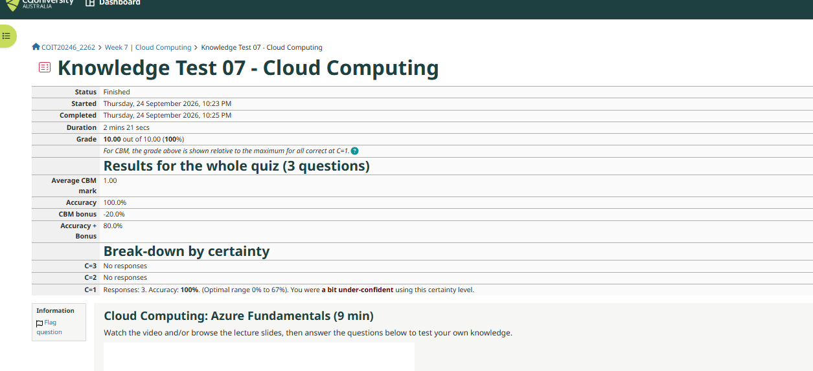
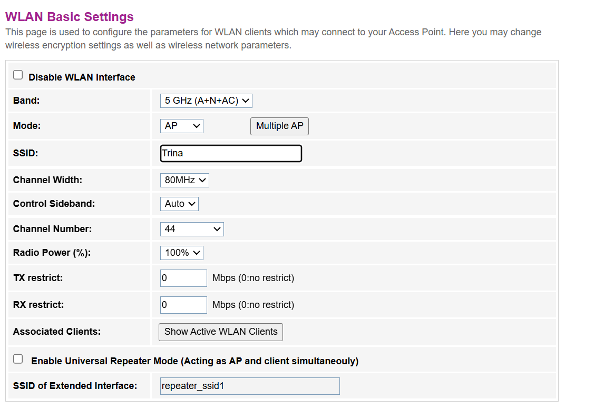
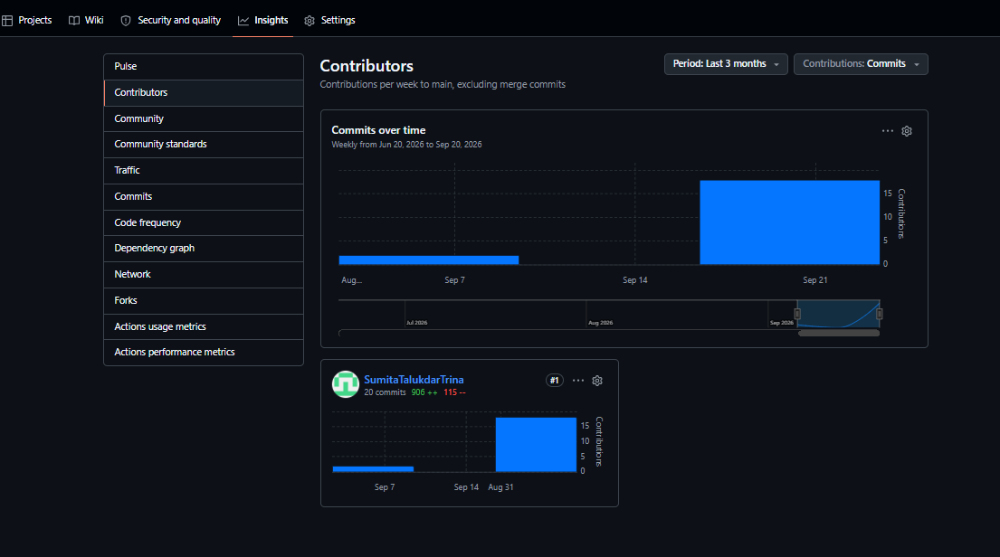

# Week 7 Journal

**Student Name:** Sumita Talukdar Trina

**Topics:** Wireless Networks (tutorial) and Cloud Computing (lecture)

---

## Task 1 - Knowledge Test



I did the Week 7 Knowledge Test on Cloud Computing (Azure Fundamentals) and got **10 out of 10 (100%)**. I got all 3 questions right in 2 minutes 21 seconds.

But I used certainty level 1 again, for the fourth week in a row. Because all my answers were right, the CBM bonus was -20%, so my accuracy + bonus was only 80%. Looking back at Weeks 4 to 7, I got 100% twice and 75% once while always using C=1, so I am losing marks for no reason. This is a pattern now, not a one-time thing. For Week 8 I will make a rule for myself: if I can explain why the answer is right, I pick C=2.

---

## Task 2 - View Wi-Fi Details

I used the built-in `netsh` command in PowerShell (the WifiTools module in the lecture is based on this command). I changed my network name to "Home_5G" in the output below because I do not want to show the real name.

```powershell
PS C:\WINDOWS\system32> netsh wlan show interfaces

    Name                   : Wi-Fi
    Description            : Intel(R) Wi-Fi 6 AX201 160MHz
    Physical address       : b0:7d:64:3d:8b:dc
    State                  : connected
    SSID                   : Home_5G (name hidden)
    AP BSSID               : 60:31:92:11:8d:d1
    Band                   : 5 GHz
    Channel                : 44
    Network type           : Infrastructure
    Radio type             : 802.11ac
    Authentication         : WPA2-Personal
    Cipher                 : CCMP
    Receive rate (Mbps)    : 234
    Transmit rate (Mbps)   : 390
    Signal                 : 81%
    Rssi                   : -69

PS C:\WINDOWS\system32> netsh wlan show networks mode=bssid

There are 1 networks currently visible.

SSID 1 : Home_5G (name hidden)
    Network type            : Infrastructure
    Authentication          : WPA2-Personal
    Encryption              : CCMP
    BSSID 1                 : 60:31:92:11:8d:d1
         Signal             : 81%
         Radio type         : 802.11ac
         Band               : 5 GHz
         Channel            : 44
         Bss Load:
             Connected Stations:         2
             Channel Utilization:        3 (1 %)
         Basic rates (Mbps) : 6 9 12 18 24
         Other rates (Mbps) : 36 48 54
```

| Information | My home AP |
|---|---|
| SSID | Home_5G (real name hidden) |
| BSSID | 60:31:92:11:8d:d1 |
| Frequency band | 5 GHz |
| Channel | 44 |
| Standard | 802.11ac (Wi-Fi 5) |
| Security | WPA2-Personal with CCMP (AES) |
| Data rate I connect with | 234 Mbps receive, 390 Mbps transmit |
| Signal | 81% (RSSI -69 dBm) |
| Other devices on it | 2 connected stations, 1% channel use |

Only one network was visible from my laptop, so I could only list one AP.

What I noticed:

- **The BSSID is almost the same as my router's MAC.** In Week 6 my ARP table showed my router 192.168.1.1 has MAC 60-31-92-11-8D-D0. The BSSID here is 60:31:92:11:8d:**d1**, just one number higher. So the router uses one MAC address for its LAN side and the next one for its Wi-Fi radio. This shows it is one all-in-one box, like the lecture example.
- **My laptop is Wi-Fi 6, but it connects with Wi-Fi 5.** The adapter is "Intel Wi-Fi 6 AX201", but the radio type is 802.11ac. The connection can only be as new as the older side, and my router only supports 802.11ac.
- **The real speed is much lower than the maximum.** The lecture table says 802.11ac can reach 433 Mbps per antenna with an 80 MHz channel, and up to 7 Gb/s with 8 antennas. I only get 234 to 390 Mbps. My signal of -69 dBm is only medium strength, which lowers the rate.
- **The basic rates (6 to 54 Mbps) are the old 802.11a rates.** These are the slowest rates every device on 5 GHz must support, so older devices can still join.

---

## Task 3 - Use Wi-Fi Access Point

I logged in to my home router's web page at http://192.168.1.1 and looked at the **WLAN Basic Settings** for the 5 GHz network. I only looked and did not change anything, because changing settings could disconnect all the devices in my house. I blurred the SSID in the screenshot.



The status page showed that my router is a fibre (PON) device, so it is the modem, router, switch and Wi-Fi access point all in one box, like the "all-in-one wireless router" in the lecture.

These are the settings I think are the most important, and what I would change:

| Setting | Current value | What I would do and why |
|---|---|---|
| **Band** | 5 GHz (A+N+AC) | Keep it. 5 GHz is faster and has more non-overlapping channels than 2.4 GHz, but it has shorter range and is weaker through walls. I would keep a 2.4 GHz network too, for devices far from the router or older devices. |
| **Channel** | 44 (set manually) | Keep it for now. Only my own network was visible in Task 2, and channel utilisation was only 1%, so there is no interference. If I moved to an apartment with many neighbours, I would do a site survey first (like the lecture says) and pick a channel nobody else uses, or set it to Auto. |
| **Channel width** | 80 MHz | Keep it at home, because a wider channel gives a higher data rate. But if there were many networks nearby, I would lower it to 40 MHz. A narrower channel means fewer overlaps with neighbours. |
| **Radio power** | 100% | I would try lowering it to 75%. Wi-Fi is broadcast, so at 100% my signal probably goes outside my house, where anyone in range can try to connect. Less power means less leakage, as long as my own rooms still get a good signal. |
| **SSID** | (hidden) | I would change it to a name that does not show a person's name or the router model. The SSID is broadcast in beacons, so every neighbour can see it. |
| **Security** | WPA2-Personal, CCMP (from Task 2) | WPA2 with CCMP is OK, but I would change to **WPA3** (or WPA2/WPA3 mixed) if the router supports it, and use a long Wi-Fi password. The lecture says WPA2 or later is the minimum. I would also make sure WPS is turned off. |
| **Router admin password** | (not shown) | I would change it from the default one on the sticker. Anyone on my Wi-Fi can open 192.168.1.1, so a default password lets them change all these settings. |
| **Repeater mode** | Off | Keep it off. I only need one AP for my home. If one room had a weak signal, I would use it to extend the network. |
| **TX / RX restrict** | 0 (no limit) | Keep it at home. In a business, I would set a limit on a guest network so one guest cannot use all the bandwidth. |

The main thing I learned is that the settings are always a trade-off between **speed, range and security**. For example, 80 MHz and 100% power give the best speed and range, but make interference and signal leakage worse.

---

## Task 4 - Self-Evaluation of Teamwork

I am doing the project on my own, not in a team. I still did this task by comparing the AI's advice with how I have been working alone, and with what I would do if I were in a team.

### AI prompt and output

I asked ChatGPT: *"Give me a list of ways to improve teamwork in a university group project."*


### Comparing the AI's list with what I have done

| AI suggestion | Am I doing it? | My specific example |
|---|---|---|
| Set clear goals | Yes | Each week I use the "In your journal" list in the tutorial sheet as my goal list, and I check each task off. For Week 6 I made a list of every screenshot and file I needed before I started. |
| Define roles and responsibilities | Not really | Because I am alone, I do every role. But I have not confirmed with my tutor that working alone is allowed. I should email my tutor this week to make it official. |
| Communicate regularly | No | I have not told my tutor or unit coordinator that I am working alone, or that my journal is late. I should send one email to explain both, instead of waiting. |
| Use collaboration tools | Yes | I use GitHub for my journal and commit my files, draw.io for my diagrams, and AI to help with drafting (which the unit allows, as long as I check and edit it). |
| Make a timeline and meet deadlines | No | My Journal Part 2 was due on 18 September and I missed it. I did Weeks 4 to 7 in one day. If I could start again, I would finish each week's tasks straight after that tutorial, and commit them the same week. |
| Give and ask for feedback | Partly | I got feedback from the Knowledge Tests and from AI, but not from my tutor. For the rest of the project I will use Task 5 in the tutorial to show my tutor my progress and ask what I should fix. |
| Share the work fairly | Not applicable | I do all the work myself. If I were in a team, I would split the tasks using GitHub Issues, so everyone can see who is doing what. |
| Resolve conflicts early | Not applicable | I have no team, so I have had no conflicts. |

### GitHub commits

I do not have a separate project repository, so this screenshot is from my journal repository.



All the commits are mine because I am the only one working on it. So I cannot really compare with other team members. Teams in my class with 3 or 4 people would have more commits in total, and their graph would show if everyone did an equal part.

The bigger problem the graph shows is **timing**. All my commits happened on the same day, 24 September, instead of being spread across the weeks. The assessment says the commit history must show regular weekly entries. So for the rest of the unit, I will commit after every tutorial, even if the week is not finished, so the graph shows steady work instead of one big spike.

---

## Reflection

This week's lecture was about cloud computing, and I realised I have already been using it in this unit without thinking about it.

The lecture explained the three service types. My OpenWRT VM in VirtualBox is like my own small version of **IaaS**: I get a whole virtual computer and I have to set up and fix everything myself, like the eth0 and eth1 problem in Week 6. In a real IaaS cloud like Azure, I would rent a VM in the same way, but it would run in a data centre instead of on my laptop. GitHub and ChatGPT are **SaaS**, because I just use the application through my browser and do not manage any servers.

The **shared responsibility model** also makes sense to me now. GitHub looks after its servers and data centres, but I am still responsible for my own settings, like making my repository private and adding my tutor as a collaborator. If I leave my repo public, that is my mistake, not GitHub's.

The Wi-Fi tasks linked to the cloud too. The lecture said cloud services need **broad network access**. For me, that access starts with my home Wi-Fi. Every time I use GitHub or Moodle, my laptop sends the data over 5 GHz Wi-Fi to my router at 60:31:92:11:8d:d1, and then out to the Internet. So the security settings I looked at in Task 3, like WPA2/WPA3 and the router password, protect my cloud accounts as well.

Task 4 was the hardest to be honest about. Looking at the AI's list made me see that my biggest problem is not teamwork, it is time management and communication. I did Weeks 4 to 7 in one day and have not emailed my tutor yet. The AI list was useful, but it was very general. I had to think about which points actually apply to someone working alone.
