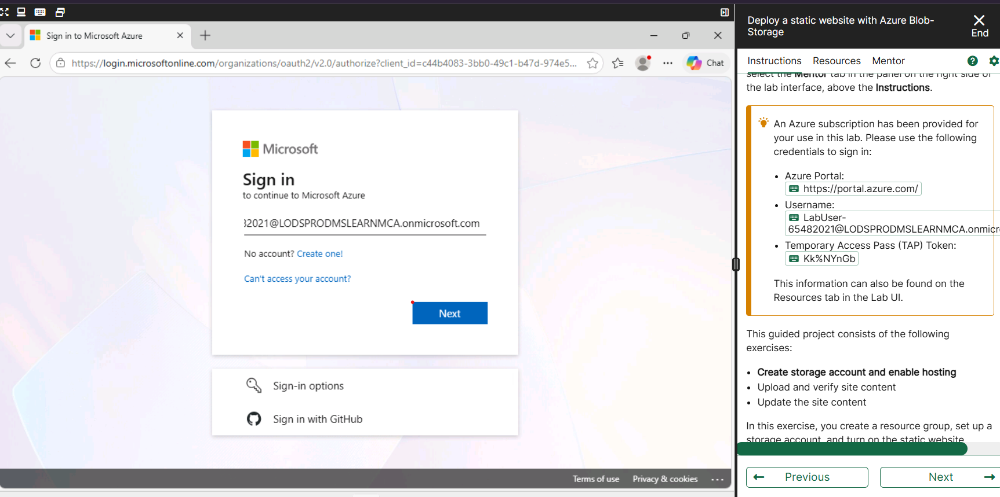
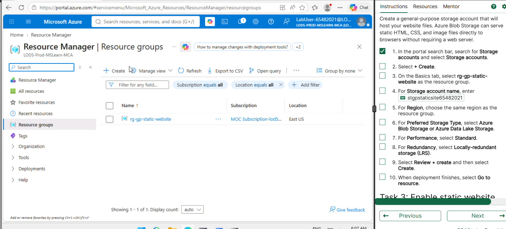
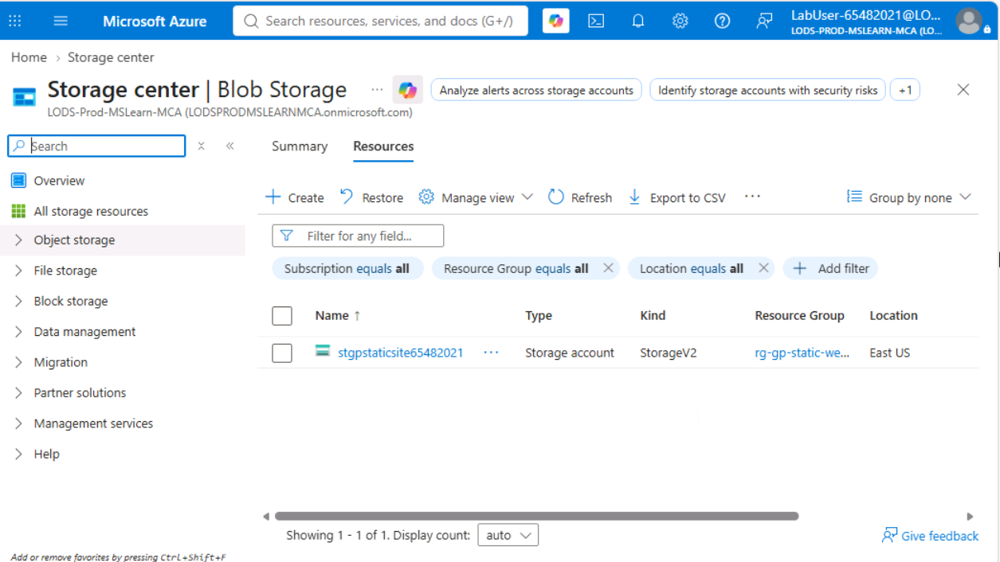
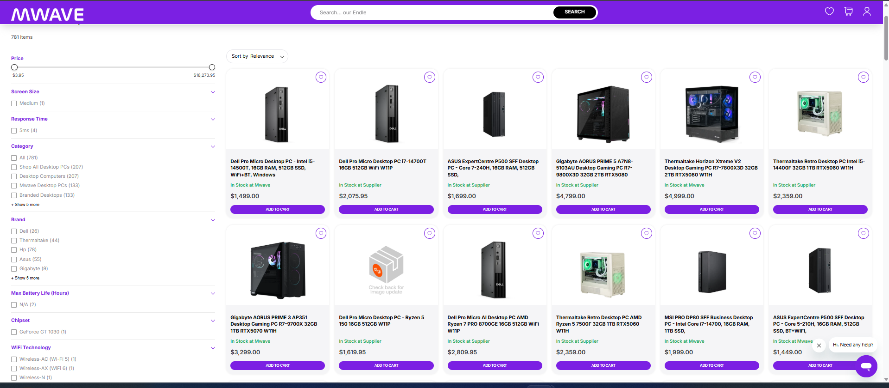

# Week 8 Journal

**Student Name:** Sumita Talukdar Trina

**Topics:** Cloud Computing (tutorial) and Attacks and Vulnerabilities (lecture)

---

## Task 1 - Knowledge Test

I did the Week 8 Knowledge Test on Attacks and Vulnerabilities and got **10 out of 10 (100%)**. All 5 questions right and it only took me about 3 minutes.

But again I used C=1 for everything. The CBM bonus was -20% so my final score was 80% even though I got every question right. I have been doing this every single week and losing marks for no reason. Next week I am actually going to use C=2 when I know the answer. I keep saying this so I have to actually do it.

---

## Task 2 - Login to Microsoft Learn on Demand

I registered on msle.learnondemand.net with the training key from Moodle and my @cqumail.com email. It took me a couple of minutes to figure out that after registering you have to log out and log back in using Sign In and then Skillable Account, not the same way you registered. Once I was in I found the COIT20246 class and the Azure activities.

---

## Task 3 - Create an Azure Resource

For this task I created a resource group and a storage account in the Azure portal. The resource group is called **rg-gp-static-website** and I created it in East US. Then I made the storage account **stgpstaticsite65482021** inside it, using Azure Blob Storage, Standard performance and LRS redundancy.

Here is what each resource does:

| Resource | Type | What it is for |
|---|---|---|
| rg-gp-static-website | Resource group | Keeps all the related resources in one place so you can manage or delete them together |
| stgpstaticsite65482021 | Storage account (StorageV2) | Stores the files. Azure can serve HTML files from here directly to a browser with no web server needed |
| $web | Blob container (auto-created) | The special container where you put your website files. Azure creates it automatically when you turn on static hosting |

After that I turned on static website hosting, set the index document to `index.html` and the error page to `404.html`. Azure gave me this public URL for the site: `https://stgpstaticsite65482021.z13.web.core.windows.net/`

What surprised me here was that I never had to set up a web server at all. I just uploaded files and Azure served them. That is quite different from the OpenWRT web server I set up in Week 6 where I had to SSH in and edit files manually.

---

## Task 4 - Create an Azure Virtual Machine and Allow Web Access

For this part I created the actual website content. I opened Notepad and wrote two HTML files: `index.html` for the main page and `404.html` for when someone visits a page that does not exist. Then I uploaded both to the `$web` container.

Both files showed up in the container list with their sizes and access tier set to Hot, which means they are ready to serve at any time.

I opened the primary endpoint URL and the page loaded and showed "Version 1 - Landing Page". I also typed `/fakepage` at the end of the URL to test the 404 page and it worked, showing my custom error page instead of the ugly Azure XML error.

Then I made a Version 2 of `index.html` and uploaded it with the overwrite option ticked. When I refreshed the browser it changed to Version 2 straight away. No restart needed, nothing. That is one thing I really liked about blob storage compared to a normal server.

The two security rules on the VM and what they do:

| Rule | Port | What it allows |
|---|---|---|
| default-allow-ssh | 22 | SSH access so the admin can log into the VM and manage it from the command line |
| AllowAnyHTTPInbound | 80 | HTTP traffic from the internet so anyone can open the website in a browser |

Before I added the HTTP rule, trying to open the website gave a connection timed out error. As soon as I added port 80 it worked. This shows why firewalls and network security groups matter. By default Azure blocks everything and you have to specifically allow what you need.

---

## Task 5 - Compare Cloud vs On-premise Costs

I looked up a desktop PC on mwave.com.au and compared it with a similar Azure VM using the pricing calculator set to Australia East and AUD.

### Desktop PC

**Dell Pro Micro Desktop PC - Intel i5-14500T, 16GB RAM, 512GB SSD, WiFi+BT, Windows 11 Pro**
Price: **AUD $1,499.00** from mwave.com.au

### Azure VM

**Standard_D2s_v3** - 2 vCPU, 8GB RAM, Australia East, Linux, pay-as-you-go
Cost: **approx. AUD $142/month**

### Comparison table

| | Desktop PC (Dell i5-14500T) | Azure VM (D2s_v3) |
|---|---|---|
| CPU | Intel i5-14500T, 14 cores | 2 vCPU |
| RAM | 16 GB | 8 GB |
| Storage | 512 GB SSD | 16 GB temp (disk extra) |
| OS | Windows 11 Pro | Linux |
| Upfront cost | AUD $1,499 | AUD $0 |
| Monthly cost | $0 after purchase | ~AUD $142 |
| 1-year total | AUD $1,499 | AUD $1,704 |
| 3-year total | AUD $1,499 | AUD $5,112 |

The Azure price does not include the managed disk or data transfer so the real cost is a bit higher.

Looking at the 3-year numbers, the desktop PC is much cheaper if you run it all the time. But that is not the full story.

The PC costs $1,499 upfront no matter what, even if you only need it for two weeks. With Azure you pay nothing upfront and can stop any time. If a company only needs a server for a short project, Azure is much cheaper. Also if the PC breaks you have to pay for repairs or buy a new one. Azure just keeps running.

On the other hand, the PC is faster, has more RAM and does not need internet to work. The data stays on your own hardware which some companies need for legal or privacy reasons.

The lecture talked about CapEx (capital expenditure, like buying the PC) vs OpEx (operational expenditure, like paying monthly for Azure). Most companies now prefer OpEx because it is easier to budget and you do not need a big upfront investment. For a student or a small project the desktop PC makes more sense, but for a business that needs to scale up or down quickly, Azure wins.

---

## Reflection

The lecture this week was about Attacks and Vulnerabilities and the CIA triad: Confidentiality, Integrity and Availability.

Doing the Azure lab made these feel more real than just reading about them. When I created the storage account the default was private, so no one could read the files without permission. That is confidentiality. When I uploaded Version 2 of the website, Azure checked that the file uploaded correctly before making it available. That is integrity. And because Azure runs across multiple data centres, the website stays up even if one server has a problem. That is availability. I did not have to set any of this up myself, it is just how Azure works.

The lecture also covered STRIDE. The one that applies most to my website is information disclosure. If I had accidentally set my container to public when it should have been private, anyone who knew the URL could have downloaded my files. The storage account key is also a risk. If someone got hold of it they could tamper with my files or even delete everything.

The thing that stuck with me is that security is my responsibility even when I use cloud services. Azure looks after the physical data centres and the hardware, but I am the one who decides if a container is public or private, who has the keys and what rules are on the firewall. The shared responsibility model means I cannot blame Azure if I make a mistake with my own settings.
