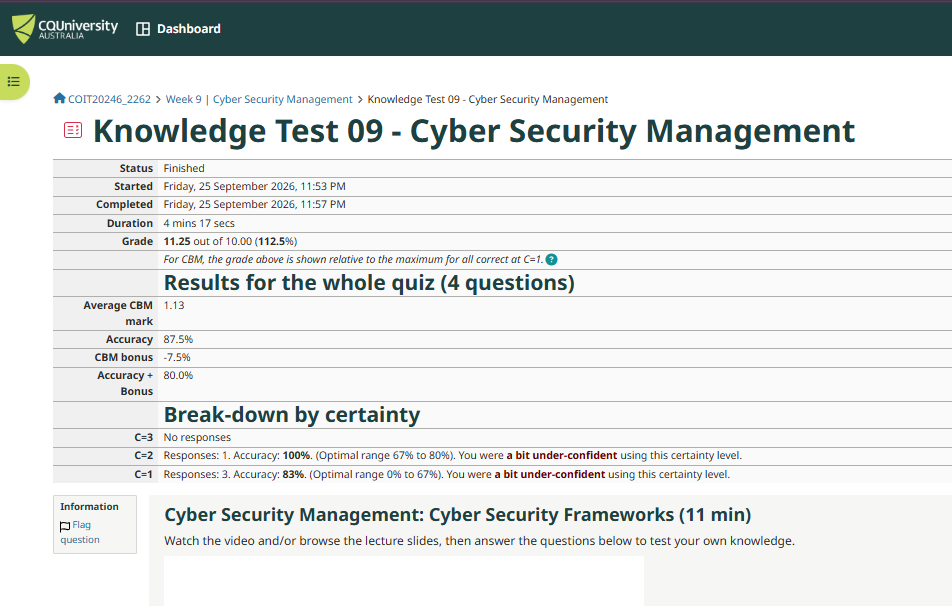

# Week 9 Journal

**Student Name:** Sumita Talukdar Trina

**Topics:** Attacks and Vulnerabilities (tutorial) and Cyber Security Management (lecture)

---

## Task 1 - Knowledge Test

I did the Week 9 Knowledge Test on Cyber Security Management and got **11.25 out of 10 (112.5%)**. That is more than 10 because I finally used C=2 for one question and got it right, which gave me a bonus. My accuracy was 87.5%.

I have been using C=1 every week and getting -20% each time even when I got everything right. This week using C=2 once made a real difference. I should have done this from the start.

---

## Task 2 - CIA Protections

Since I am doing the project alone, I used a home network scenario. I thought about what the important assets are and what needs to be protected.

**Asset 1: Wi-Fi router**
- Protection: Availability
- Reason: If the router goes down, nothing on the network works. Everyone loses internet.
- Protection: Confidentiality
- Reason: The router has an admin page. If someone gets in, they can see all connected devices and change the settings.

**Asset 2: Files on the laptop**
- Protection: Confidentiality
- Reason: Personal files, documents and passwords should only be readable by the owner. If the laptop gets stolen or hacked, these are exposed.
- Protection: Integrity
- Reason: Ransomware can encrypt files without the user knowing. The user loses access to their own data.

**Asset 3: Wi-Fi access**
- Protection: Confidentiality
- Reason: Without WPA2 or WPA3 encryption, anyone nearby can see the wireless traffic. I saw this myself in Week 6 when I read HTTP packets in Wireshark.
- Protection: Availability
- Reason: An attacker can flood the access point with fake connection requests, making it unusable for everyone else.

**Asset 4: Login credentials**
- Protection: Confidentiality
- Reason: Passwords must not be stored in plain text or sent over unencrypted connections. If the router admin password leaks, the attacker controls the whole network.
- Protection: Integrity
- Reason: If an attacker changes the admin password, the real owner gets locked out.

**Asset 5: Network traffic**
- Protection: Confidentiality
- Reason: HTTP traffic can be read by anyone on the same network. HTTPS encrypts it so only the sender and receiver can read it.
- Protection: Integrity
- Reason: A man-in-the-middle attacker can intercept and change packets. HTTPS prevents this too.

---

## Task 3 - Threat Sources and Motivation

**Threat Source 1: Neighbour or someone nearby**
- Motivation: Wants free internet. They can see my Wi-Fi network and try to guess the password. If it is weak or still the default one, they can get in.

**Threat Source 2: Malware from the internet**
- Motivation: No specific person. Automated malware spreads through downloads or email attachments. Ransomware encrypts files and asks for money. Other malware steals passwords and sends them to the attacker.

**Threat Source 3: Remote attacker scanning the internet**
- Motivation: Looking for routers with default passwords and open ports. Attackers scan millions of IP addresses automatically to find easy targets. Most home routers never get their passwords changed.

**Threat Source 4: Phishing attacker**
- Motivation: Tricks the user into typing their password into a fake website. For example a fake bank page or a fake Microsoft login. The attacker gets the credentials without ever hacking anything.

**Threat Source 5: Physical attacker**
- Motivation: If someone physically touches the router, they can reset it to factory settings and remove the password. Or they could plug in a USB drive with malware into the laptop. Physical access is just as dangerous as remote access.

---

## Task 4 - Explore Vulnerabilities

I searched NIST NVD at nvd.nist.gov and picked three CVEs from the past 12 months with different severity levels.

---

### CVE 1 – Critical: CVE-2024-38063

| Field | Details |
|---|---|
| CVE ID | CVE-2024-38063 |
| Date | August 2024 |
| Company | Microsoft |
| Product | Windows TCP/IP stack |
| CVSS v3 Score | 9.8 (Critical) |
| CWE | CWE-191: Integer Underflow |
| Confidentiality impact | High |
| Integrity impact | High |
| Availability impact | High |

**What the product is:** The TCP/IP stack is the part of Windows that handles all network communication. Every version of Windows uses it.

**What the vulnerability is:** There is a bug in how Windows processes IPv6 packets. An attacker can send a specially crafted packet to a Windows computer and run their own code on it. No user interaction is needed. The attacker just needs to be able to send packets to the machine.

**Simple explanation:** Imagine someone can break into your house just by ringing the doorbell in a specific way, without you even opening the door. That is basically what this bug allows over the network.

**Detection and mitigation:** Install the Microsoft security update from August 2024. If patching is not possible right away, disabling IPv6 on the network interface reduces the risk.

---

### CVE 2 – High: CVE-2024-29988

| Field | Details |
|---|---|
| CVE ID | CVE-2024-29988 |
| Date | April 2024 |
| Company | Microsoft |
| Product | Windows SmartScreen |
| CVSS v3 Score | 8.8 (High) |
| CWE | CWE-693: Protection Mechanism Failure |
| Confidentiality impact | High |
| Integrity impact | High |
| Availability impact | High |

**What the product is:** SmartScreen is a Windows feature that shows a warning when you try to run a file downloaded from the internet. It is meant to stop malware from running.

**What the vulnerability is:** A specially crafted file can skip the SmartScreen warning completely. The user downloads a malicious file, double-clicks it, and it runs without any warning showing up.

**Simple explanation:** SmartScreen is like a security guard who checks everyone at the door. This bug lets attackers make a fake staff badge so the guard waves them through without checking.

**Detection and mitigation:** Install the April 2024 Microsoft security update. Endpoint detection tools can still catch the malicious behaviour even if SmartScreen is bypassed.

---

### CVE 3 – Medium: CVE-2024-23225

| Field | Details |
|---|---|
| CVE ID | CVE-2024-23225 |
| Date | March 2024 |
| Company | Apple |
| Product | iOS and iPadOS kernel |
| CVSS v3 Score | 5.5 (Medium) |
| CWE | CWE-787: Out-of-bounds Write |
| Confidentiality impact | High |
| Integrity impact | None |
| Availability impact | None |

**What the product is:** The kernel is the core of the iOS operating system. It manages memory and controls what apps are allowed to do.

**What the vulnerability is:** A malicious app on the phone can read kernel memory, which apps are not supposed to be able to do. Apple said this was already being actively exploited when they found it.

**Simple explanation:** Each app on your phone is supposed to be in its own box and cannot see what other apps or the system are doing. This bug lets a malicious app peek outside its box and read private system memory. Because attackers were already using it, that means iPhones were being exploited before Apple even knew the bug existed.

**Detection and mitigation:** Update to the patched iOS version Apple released in March 2024. Always install Apple security updates quickly, especially when Apple says a vulnerability "may have been actively exploited."

---

## Task 5 - Vulnerability Disclosures

When a security researcher finds a bug in software, they have to decide what to do with it. If they tell the public straight away, attackers can use the information before anyone has a patch ready. If they only tell the vendor and keep it secret forever, users never know their software has a problem.

The most common approach is called responsible disclosure or coordinated disclosure. The researcher reports it privately to the vendor, gives them time to fix it, and then makes it public after the patch is released. The standard timeframe is 90 days, which became popular after Google Project Zero started using it.

90 days sounds fair to me. It is enough time for the vendor to understand the bug and release a fix. But vendors sometimes want more time because the fix is complex, or they need to coordinate with other companies who use the same code. That is understandable, but waiting too long is also risky. If two researchers can find the same bug, so can an attacker.

The worst case is what happened with CVE-2024-23225: attackers were already using the bug before Apple even knew about it. That is called a zero-day. If a researcher had found it first and reported it responsibly, Apple could have fixed it before anyone got hurt.

If a vendor misses the 90-day deadline with no communication or patch, I think the researcher should go public. Users have a right to know that their software has a serious unfixed vulnerability, so they can take steps to protect themselves, like disabling a feature or switching to a different product. Keeping it secret does not help users, it only helps attackers who might already know about the bug.

Bug bounty programs help a lot here. Companies like Microsoft and Apple pay researchers real money for finding and reporting bugs privately. This gives researchers a reason to report to the vendor instead of selling the information to someone who would use it to attack people. It makes the whole system work better for everyone except the attackers.

---

## Reflection

The lecture this week was about Cyber Security Management and the NIST Cybersecurity Framework with its five functions: Identify, Protect, Detect, Respond and Recover.

Looking back at the past few weeks, I can see I have actually been doing all five without realising it had a name.

In Week 7 I logged into my router and looked at the settings. That was Identify and Protect: I identified my home network assets and checked what protections were on, like WPA2 and the admin password. In Week 6 I used Wireshark to capture packets and saw the HTTP request in plain text. That is Detect: monitoring traffic to see what is happening. In Week 4 I cleared the ARP table and saw how the router's MAC address came back after a ping. Understanding how things work normally helps you notice when something is wrong.

The CVE task was the most eye-opening part. Before this week, when I saw "security update available" on my phone or laptop I sometimes ignored it. Now I know there is probably a real CVE behind that notification. Someone found the bug, reported it, the vendor fixed it, and now the update is waiting for me to install. If I ignore it, I am running software with a known flaw that attackers can look up on NVD just as easily as I did today.

The KT question about the ACSC Essential Eight also made sense after looking at the CVEs. All three vulnerabilities I found are fixed by simply installing the security update. That is one of the Essential Eight: patch your applications and operating systems. It sounds obvious but it is still one of the most common reasons systems get compromised.
